# Análisis de Rentabilidad y Eficiencia Operativa — Superstore (SQL Server)

## Índice

1. [Descripción del Proyecto](#1-descripción-del-proyecto)
2. [Objetivos](#2-objetivos)
3. [Tecnologías Utilizadas](#3-tecnologías-utilizadas)
4. [Dataset Utilizado](#4-dataset-utilizado)
5. [Metodología](#5-metodología)
6. [Estructura del Repositorio](#6-estructura-del-repositorio)
7. [Preguntas de Negocio](#7-preguntas-de-negocio)
8. [Storytelling del Análisis](#8-storytelling-del-análisis)
9. [Conclusiones y Recomendaciones](#9-conclusiones-y-recomendaciones)
10. [Cómo Reproducir este Análisis](#10-cómo-reproducir-este-análisis)

## 1. Descripción del Proyecto
Proyecto de análisis de datos desarrollado en SQL Server (T-SQL) sobre 
~9,993 transacciones de una cadena retail (Superstore, 2014-2017), con foco 
en identificar patrones de rentabilidad, eficiencia de descuentos y 
comportamiento de clientes. Desarrollado como proyecto final del curso 
"SQL for Data Analyst" (Data Academy Latam) y como pieza de portafolio 
para procesos de selección como Data Analyst.

## 2. Objetivos

**Objetivo General:**  
Analizar el desempeño de ventas, rentabilidad y eficiencia logística de 
Superstore mediante SQL Server, generando hallazgos y recomendaciones 
accionables aplicables a distintas áreas del negocio.

**Objetivos Específicos:**
- Identificar las categorías y sub-categorías con mayor y menor rentabilidad.
- Evaluar el impacto del descuento sobre el margen de ganancia.
- Medir la eficiencia del proceso de despacho por modo de envío y región.
- Segmentar clientes según su contribución a la rentabilidad total.
- Detectar patrones estacionales o regionales en el volumen de pedidos.

## 3. Tecnologías Utilizadas
- Microsoft SQL Server (T-SQL)
- SQL Server Management Studio (SSMS)
- Git y GitHub (control de versiones y publicación)
- Funciones y técnicas: `SELECT`, `WHERE`, `ORDER BY`, `GROUP BY`, `HAVING`, 
  `CASE WHEN`, `INNER JOIN`, subconsultas simples y correlacionadas, CTEs, 
  funciones de agregación, `ROW_NUMBER()`, `RANK()`, `NTILE()`, funciones 
  de ventana con `SUM() OVER()`, Views

## 4. Dataset Utilizado
**Fuente:** [Sample Superstore Dataset – Kaggle](https://www.kaggle.com/datasets/vivek468/superstore-dataset-final)  
**Registros:** 9,994 originales (9,993 tras limpieza)  
**Columnas:** 21  

El dataset contiene información de pedidos, clientes, productos, envíos y 
métricas financieras de una cadena retail en Estados Unidos. Ver el 
diccionario de datos completo en 
[`/documentation/diccionario_datos.md`](./documentation/diccionario_datos.md).

## 5. Metodología
1. **Carga de datos:** Importación del archivo `Superstores.csv` a SQL Server 
   mediante el asistente "Import Flat File" de SSMS.
2. **Exploración y calidad de datos:** Validación de estructura, nulos, 
   duplicados, categorías, valores atípicos y consistencia de fechas.
3. **Limpieza:** Eliminación de 1 registro duplicado real detectado 
   (de 8 casos similares investigados, solo 1 resultó ser un duplicado exacto).
4. **Modelado dimensional:** Normalización del dataset plano en un modelo 
   de tabla de hechos + dimensiones (`Fact_Orders`, `Dim_Customers`, 
   `Dim_Products`), resolviendo dos hallazgos de diseño: la ubicación es un 
   atributo del pedido (no del cliente), y algunos `Product_ID` estaban 
   duplicados con nombres distintos en el dataset original.
5. **Análisis:** Desarrollo de 10 preguntas de negocio progresivas 
   (de nivel básico a avanzado) más una vista de reporte reutilizable.

## 6. Estructura del Repositorio

```
superstore-sql-analysis/
├── README.md
├── dataset/
│   └── Superstores.csv
├── scripts/
│   ├── 01_create_staging_table.sql
│   ├── 02_load_staging_data.sql
│   ├── 03_data_quality_checks.sql
│   ├── 04_data_cleaning.sql
│   ├── 05_create_dimensional_model.sql
│   └── 06_business_questions_01_10.sql
├── screenshots/
│   ├── banner_SQL.png
│   └── (capturas numeradas de calidad de datos, modelo dimensional y preguntas de negocio)
└── documentation/
    └── diccionario_datos.md
```

## 7. Preguntas de Negocio

### Pregunta 1: ¿Cuáles son las 3 sub-categorías con mayor y menor rentabilidad total?

**Justificación empresarial:** Identificar qué sub-categorías sostienen el negocio y cuáles lo están drenando es el primer paso de cualquier revisión de portafolio de productos.  
**Complejidad:** Básico

```sql
SELECT TOP 3 
    p.Sub_Category,
    SUM(f.Profit) AS Rentabilidad_Total
FROM Fact_Orders f
INNER JOIN Dim_Products p ON f.Product_ID = p.Product_ID
GROUP BY p.Sub_Category
ORDER BY Rentabilidad_Total DESC;

SELECT TOP 3 
    p.Sub_Category,
    SUM(f.Profit) AS Rentabilidad_Total
FROM Fact_Orders f
INNER JOIN Dim_Products p ON f.Product_ID = p.Product_ID
GROUP BY p.Sub_Category
ORDER BY Rentabilidad_Total ASC;
```

**Resultado:**

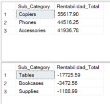

**Interpretación e insight de negocio:** Tables es la sub-categoría más problemática del negocio, con una pérdida acumulada muy superior a Bookcases y Supplies juntas. Technology (Copiers, Phones, Accessories) domina la rentabilidad positiva.  
**Recomendación:** Priorizar una revisión de pricing específicamente en Tables, dado que es la sub-categoría más problemática por un margen amplio.

---

### Pregunta 2: ¿Qué categorías tienen más de 100 pedidos con rentabilidad negativa, y cuáles superan el promedio general?

**Justificación empresarial:** No basta con saber que hay pérdidas. Hay que saber si están concentradas o distribuidas en todo el negocio.  
**Complejidad:** Básico-Intermedio

```sql
SELECT 
    p.Category,
    COUNT(*) AS Pedidos_Con_Perdida
FROM Fact_Orders f
INNER JOIN Dim_Products p ON f.Product_ID = p.Product_ID
WHERE f.Profit < 0
GROUP BY p.Category
HAVING COUNT(*) > 100
   AND COUNT(*) > (
        SELECT AVG(ConteoPorCategoria)
        FROM (
            SELECT COUNT(*) AS ConteoPorCategoria
            FROM Fact_Orders f2
            INNER JOIN Dim_Products p2 ON f2.Product_ID = p2.Product_ID
            WHERE f2.Profit < 0
            GROUP BY p2.Category
        ) AS Sub
   )
ORDER BY Pedidos_Con_Perdida DESC;
```

**Resultado:**

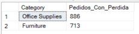

**Interpretación e insight de negocio:** Las pérdidas están concentradas en solo 2 de las 3 categorías. Technology no aparece en el resultado, lo que confirma que no es un problema distribuido parejo en todo el negocio.  
**Recomendación:** Enfocar cualquier revisión de descuentos o pricing en Office Supplies y Furniture primero, dejando Technology como referencia de lo que funciona bien.

---

### Pregunta 3: ¿Cómo varía el margen de rentabilidad promedio según el rango de descuento aplicado?

**Justificación empresarial:** Conecta directamente con los hallazgos anteriores y permite comprobar si el descuento es la causa real de la pérdida.  
**Complejidad:** Intermedio

```sql
SELECT 
    CASE 
        WHEN f.Discount = 0 THEN 'Sin descuento'
        WHEN f.Discount <= 0.20 THEN 'Bajo (0-20%)'
        WHEN f.Discount <= 0.40 THEN 'Medio (21-40%)'
        WHEN f.Discount <= 0.60 THEN 'Alto (41-60%)'
        ELSE 'Muy alto (61%+)'
    END AS Rango_Descuento,
    COUNT(*) AS Cantidad_Lineas,
    AVG(f.Profit) AS Rentabilidad_Promedio
FROM Fact_Orders f
GROUP BY 
    CASE 
        WHEN f.Discount = 0 THEN 'Sin descuento'
        WHEN f.Discount <= 0.20 THEN 'Bajo (0-20%)'
        WHEN f.Discount <= 0.40 THEN 'Medio (21-40%)'
        WHEN f.Discount <= 0.60 THEN 'Alto (41-60%)'
        ELSE 'Muy alto (61%+)'
    END
ORDER BY Rentabilidad_Promedio DESC;
```

**Resultado:**

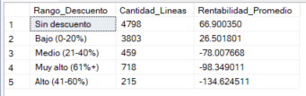

**Interpretación e insight de negocio:** La rentabilidad promedio cruza a pérdida neta a partir de descuentos del 21% en adelante. Es prácticamente el punto de quiebre del negocio en materia de descuentos.  
**Recomendación:** Establecer un techo de descuento cercano al 20% como política general, salvo excepciones justificadas caso por caso.

---

### Pregunta 4: ¿Cuál es el tiempo promedio de despacho por modo de envío y región?

**Justificación empresarial:** Mide eficiencia operativa y logística, un ángulo relevante para cualquier análisis de cadena de suministro.  
**Complejidad:** Intermedio

```sql
SELECT 
    f.Ship_Mode,
    f.Region,
    AVG(DATEDIFF(DAY, f.Order_Date, f.Ship_Date)) AS Dias_Promedio_Despacho,
    COUNT(*) AS Cantidad_Pedidos
FROM Fact_Orders f
GROUP BY f.Ship_Mode, f.Region
ORDER BY f.Ship_Mode, Dias_Promedio_Despacho DESC;
```

**Resultado:**

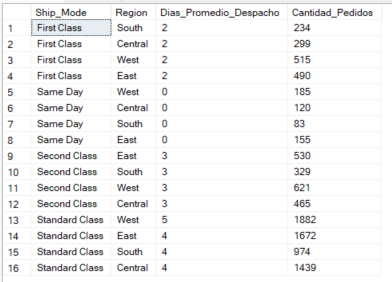

**Interpretación e insight de negocio:** La operación logística es consistente entre regiones. No hay ninguna región con tiempos anormalmente altos dentro de un mismo modo de envío, salvo una leve excepción en West dentro de Standard Class, que además es la región con más volumen de pedidos.  
**Recomendación:** No se identifica una alerta operativa grave. Vale la pena monitorear si ese ligero retraso en West escala a medida que crece el volumen de esa región.

---

### Pregunta 5: ¿Qué clientes están en el top 10% de rentabilidad generada, y a qué segmento pertenecen?

**Justificación empresarial:** Identificar a los clientes más rentables permite priorizar estrategias de retención y atención diferenciada.  
**Complejidad:** Intermedio-Avanzado

```sql
WITH RentabilidadPorCliente AS (
    SELECT 
        c.Customer_ID,
        c.Customer_Name,
        c.Segment,
        SUM(f.Profit) AS Rentabilidad_Total,
        NTILE(10) OVER (ORDER BY SUM(f.Profit) DESC) AS Decil
    FROM Fact_Orders f
    INNER JOIN Dim_Customers c ON f.Customer_ID = c.Customer_ID
    GROUP BY c.Customer_ID, c.Customer_Name, c.Segment
)
SELECT Customer_ID, Customer_Name, Segment, Rentabilidad_Total
FROM RentabilidadPorCliente
WHERE Decil = 1
ORDER BY Rentabilidad_Total DESC;
```

**Resultado:**

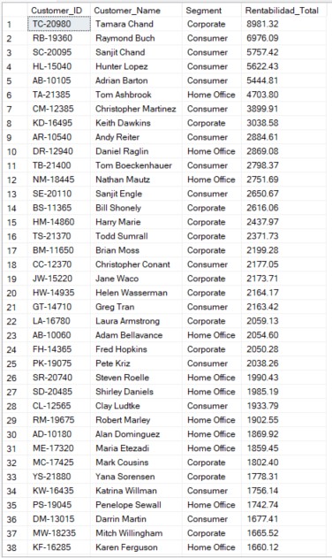

**Interpretación e insight de negocio:** El top decil está compuesto por 79 clientes (10% de 793). Tamara Chand lidera con una diferencia notable sobre el segundo lugar. Existe una alta concentración de rentabilidad en relativamente pocos clientes, el patrón clásico 80/20 en retail.  
**Recomendación:** Diseñar un programa de retención específico para este decil superior, comenzando por Tamara Chand como cliente ancla.

---

### Pregunta 6: ¿Cuáles son los 5 productos más rentables dentro de cada categoría?

**Justificación empresarial:** Identifica los productos ancla de cada categoría, útiles para decisiones de stock y continuidad de proveedor.  
**Complejidad:** Avanzado

```sql
WITH RankingProductos AS (
    SELECT 
        p.Category,
        p.Product_Name,
        SUM(f.Profit) AS Rentabilidad_Total,
        RANK() OVER (PARTITION BY p.Category ORDER BY SUM(f.Profit) DESC) AS Ranking
    FROM Fact_Orders f
    INNER JOIN Dim_Products p ON f.Product_ID = p.Product_ID
    GROUP BY p.Category, p.Product_Name
)
SELECT Category, Product_Name, Rentabilidad_Total, Ranking
FROM RankingProductos
WHERE Ranking <= 5
ORDER BY Category, Ranking;
```

**Resultado:**

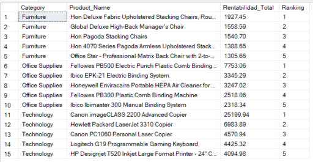

**Interpretación e insight de negocio:** El Canon imageCLASS 2200 Advanced Copier genera más del triple de rentabilidad que el segundo producto más rentable de su categoría. Existe una dependencia crítica de este producto para sostener la rentabilidad de Technology, la categoría más fuerte del negocio.  
**Recomendación:** Asegurar continuidad de stock y proveedor para el Canon imageCLASS 2200, y evaluar si su estrategia de pricing se puede replicar en otros productos de Copiers.

---

### Pregunta 7: ¿Qué porcentaje del total de ventas de cada región representa cada categoría de producto?

**Justificación empresarial:** Entender la composición de ventas por región ayuda a priorizar catálogo y esfuerzo comercial de forma diferenciada.  
**Complejidad:** Avanzado

```sql
WITH VentasPorRegionCategoria AS (
    SELECT 
        f.Region,
        p.Category,
        SUM(f.Sales) AS Ventas_Categoria
    FROM Fact_Orders f
    INNER JOIN Dim_Products p ON f.Product_ID = p.Product_ID
    GROUP BY f.Region, p.Category
)
SELECT 
    Region,
    Category,
    Ventas_Categoria,
    SUM(Ventas_Categoria) OVER (PARTITION BY Region) AS Ventas_Totales_Region,
    CAST(Ventas_Categoria * 100.0 / SUM(Ventas_Categoria) OVER (PARTITION BY Region) AS DECIMAL(5,2)) AS Porcentaje_Participacion
FROM VentasPorRegionCategoria
ORDER BY Region, Porcentaje_Participacion DESC;
```

**Resultado:**

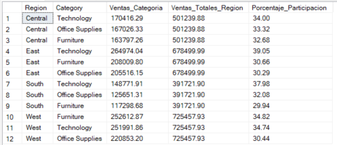

**Interpretación e insight de negocio:** Technology lidera la participación de ventas en 3 de las 4 regiones. La excepción es West, donde Furniture la supera por un margen mínimo. Office Supplies es consistentemente la categoría de menor participación en las 4 regiones, lo cual conecta con el hallazgo de la Pregunta 2 sobre concentración de pérdidas.  
**Recomendación:** Evaluar si conviene redirigir recursos hacia Technology, que muestra fortaleza tanto en participación de ventas como en rentabilidad.

---

### Pregunta 8: ¿Cuál es el cliente con mayor gasto acumulado histórico y cómo se compara contra el promedio de su segmento?

**Justificación empresarial:** Identifica cuentas atípicas que podrían requerir gestión diferenciada o reclasificación.  
**Complejidad:** Avanzado

```sql
WITH GastoPorCliente AS (
    SELECT 
        c.Customer_ID,
        c.Customer_Name,
        c.Segment,
        SUM(f.Sales) AS Gasto_Total
    FROM Fact_Orders f
    INNER JOIN Dim_Customers c ON f.Customer_ID = c.Customer_ID
    GROUP BY c.Customer_ID, c.Customer_Name, c.Segment
)
SELECT TOP 1
    g.Customer_Name,
    g.Segment,
    g.Gasto_Total,
    (SELECT AVG(g2.Gasto_Total) 
     FROM GastoPorCliente g2 
     WHERE g2.Segment = g.Segment) AS Promedio_Segmento,
    g.Gasto_Total - (SELECT AVG(g2.Gasto_Total) 
                      FROM GastoPorCliente g2 
                      WHERE g2.Segment = g.Segment) AS Diferencia_Vs_Promedio
FROM GastoPorCliente g
ORDER BY g.Gasto_Total DESC;
```

**Resultado:**

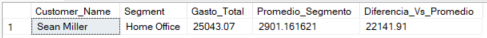

**Interpretación e insight de negocio:** Sean Miller, del segmento Home Office, gastó casi 9 veces el promedio de su propio segmento. Es un outlier extremo que se comporta más como una cuenta Corporate en volumen de compra, aunque esté clasificado en otro segmento.  
**Recomendación:** Revisar manualmente este caso. Podría ser candidato a reclasificación de segmento o a la asignación de un ejecutivo de cuenta dedicado.

---

### Pregunta 9: ¿Cómo ha evolucionado la rentabilidad mes a mes, y cuál es la rentabilidad acumulada?

**Justificación empresarial:** Entender la trayectoria de rentabilidad en el tiempo permite distinguir crecimiento sostenido de resultados puntuales.  
**Complejidad:** Avanzado

```sql
WITH RentabilidadMensual AS (
    SELECT 
        DATEPART(YEAR, f.Order_Date) AS Anio,
        DATEPART(MONTH, f.Order_Date) AS Mes,
        SUM(f.Profit) AS Rentabilidad_Mes
    FROM Fact_Orders f
    GROUP BY DATEPART(YEAR, f.Order_Date), DATEPART(MONTH, f.Order_Date)
)
SELECT 
    Anio,
    Mes,
    Rentabilidad_Mes,
    SUM(Rentabilidad_Mes) OVER (ORDER BY Anio, Mes ROWS BETWEEN UNBOUNDED PRECEDING AND CURRENT ROW) AS Rentabilidad_Acumulada
FROM RentabilidadMensual
ORDER BY Anio, Mes;
```

**Resultado:**

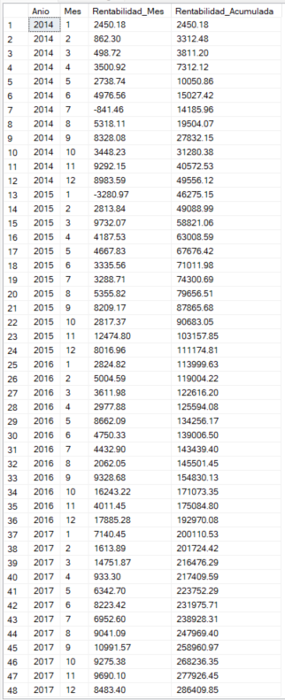

**Interpretación e insight de negocio:** La rentabilidad acumulada creció de forma sostenida entre 2014 y 2017, con una notable aceleración en los últimos dos años del período. Solo 2 de los 48 meses registraron pérdida neta.  
**Recomendación:** Investigar qué cambió operativamente en 2016-2017 para identificar si ese crecimiento acelerado es replicable.

---

### Pregunta 10: ¿Qué segmento de cliente genera mayor rentabilidad por unidad de descuento otorgado?

**Justificación empresarial:** Mide qué tan eficiente es cada segmento en convertir descuento en rentabilidad, más allá del volumen total generado.  
**Complejidad:** Avanzado

```sql
WITH MetricasPorSegmento AS (
    SELECT 
        c.Segment,
        SUM(f.Profit) AS Rentabilidad_Total,
        SUM(f.Discount) AS Descuento_Acumulado
    FROM Fact_Orders f
    INNER JOIN Dim_Customers c ON f.Customer_ID = c.Customer_ID
    GROUP BY c.Segment
)
SELECT 
    Segment,
    Rentabilidad_Total,
    Descuento_Acumulado,
    CAST(Rentabilidad_Total / NULLIF(Descuento_Acumulado, 0) AS DECIMAL(10,2)) AS Eficiencia_Rentabilidad_Por_Descuento
FROM MetricasPorSegmento
ORDER BY Eficiencia_Rentabilidad_Por_Descuento DESC;
```

**Resultado:**

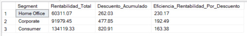

**Interpretación e insight de negocio:** Home Office es el segmento más eficiente en convertir descuento en rentabilidad, a pesar de tener la menor rentabilidad total de los tres. Consumer genera más del doble de rentabilidad total, pero es el menos eficiente en el uso de descuentos.  
**Recomendación:** Analizar qué prácticas de descuento aplica el equipo comercial con clientes Home Office, y evaluar si esa disciplina se puede replicar parcialmente en Consumer.

---

### Vista de reporte: Rentabilidad por Categoría y Región

Como cierre del análisis, se construyó una vista reutilizable que resume ventas, rentabilidad y margen porcentual por región y categoría.

```sql
CREATE OR ALTER VIEW vw_RentabilidadPorCategoriaRegion AS
SELECT 
    f.Region,
    p.Category,
    SUM(f.Sales) AS Ventas_Totales,
    SUM(f.Profit) AS Rentabilidad_Total,
    CAST(SUM(f.Profit) * 100.0 / NULLIF(SUM(f.Sales), 0) AS DECIMAL(5,2)) AS Margen_Porcentual
FROM Fact_Orders f
INNER JOIN Dim_Products p ON f.Product_ID = p.Product_ID
GROUP BY f.Region, p.Category;
```

**Resultado de la vista:**

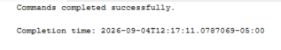
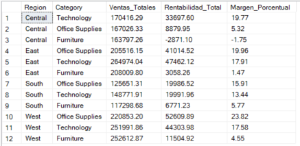

**Interpretación e insight de negocio:** Furniture es rentable en 3 de las 4 regiones. La única excepción es la región Central, donde su margen es negativo. Esto significa que el problema de rentabilidad no está en la categoría Furniture en general, sino específicamente en la combinación Furniture y región Central, impulsada principalmente por la sub-categoría Tables.  
**Recomendación:** Enfocar cualquier acción correctiva en Furniture dentro de la región Central, en lugar de aplicar una política general para toda la categoría o para toda la empresa.

---

## 8. Storytelling del Análisis

**Qué está ocurriendo**

El negocio muestra una rentabilidad sólida y en aceleración. De una ganancia acumulada de apenas 2,450 en enero de 2014, se alcanzó un acumulado de 286,409.85 al cierre de 2017, con un crecimiento notablemente más rápido en los últimos dos años del período analizado. Esta salud general oculta un problema muy específico: la categoría Furniture, y en particular su sub-categoría Tables, arrastra pérdidas significativas, concentradas casi por completo en la región Central.

**Por qué está ocurriendo**

El origen del problema está en la política de descuentos. El análisis muestra un punto de quiebre claro: cualquier descuento superior al 20% erosiona la rentabilidad promedio hasta volverla negativa, y esto se agrava en Furniture y Office Supplies, las dos categorías que concentran más líneas en pérdida que el promedio del negocio. Aun así, no todo el descuento se gestiona igual. El segmento Home Office, pese a generar la menor rentabilidad total de los tres segmentos, es el más eficiente en convertir descuento en ganancia.

**Qué impacto tiene**

El negocio depende de forma desproporcionada de unos pocos motores de rentabilidad. Un solo producto, el Canon imageCLASS 2200 Advanced Copier, genera más de tres veces la rentabilidad del segundo producto más rentable de su categoría. La rentabilidad de clientes también está concentrada: el 10% superior de clientes lidera con Tamara Chand muy por delante del resto, y un caso atípico, Sean Miller, gasta 9 veces el promedio de su propio segmento.

**Qué decisiones podrían tomarse**

1. Revisar la política de descuento específicamente en Furniture dentro de la región Central, no en toda la categoría a nivel nacional.
2. Establecer un techo de descuento cercano al 20% como política estándar.
3. Asegurar continuidad de stock y proveedor para el Canon imageCLASS 2200, y diseñar un programa de retención para el top 10% de clientes.

---

## 9. Conclusiones y Recomendaciones

**Conclusiones Ejecutivas**

El análisis de 9,993 transacciones de Superstore (2014-2017) confirma un negocio saludable y en crecimiento acelerado, con una rentabilidad acumulada que se multiplicó por más de 100 veces en el período. Este desempeño agregado positivo convive con focos de ineficiencia puntuales y concentraciones de riesgo que, de no gestionarse, podrían limitar el crecimiento futuro.

**Hallazgos Principales**
- La rentabilidad negativa se concentra en Furniture dentro de la región Central, impulsada principalmente por la sub-categoría Tables.
- Existe un umbral crítico de descuento del 20%, por encima del cual la rentabilidad promedio se vuelve negativa.
- El negocio depende de forma desproporcionada de un producto (Canon imageCLASS 2200) y un cliente (Tamara Chand).
- Home Office es el segmento con mejor disciplina de descuento, pese a no ser el de mayor volumen.

**Oportunidades Detectadas**
- Redirigir foco comercial hacia Technology, la categoría con mejor desempeño sostenido.
- Replicar la disciplina de descuento de Home Office en Consumer, el segmento de mayor volumen.
- Diseñar un programa de fidelización para el 10% superior de clientes por rentabilidad.

**Riesgos Detectados**
- Concentración de producto: dependencia del Canon imageCLASS 2200 para gran parte de la rentabilidad de Technology.
- Concentración de cliente: el caso de Sean Miller sugiere una cuenta crítica sin gestión diferenciada aparente.
- Erosión de margen por descuento no calibrado en Furniture y Office Supplies.

**Recomendaciones Estratégicas**
1. Implementar un techo de descuento cercano al 20%, con excepciones justificadas caso por caso.
2. Enfocar la revisión de pricing de Furniture específicamente en la región Central.
3. Establecer un plan de continuidad de stock y proveedor para el Canon imageCLASS 2200.
4. Crear un programa de cuentas clave para el top 10% de clientes por rentabilidad.

**Próximos Pasos**
- Extender el análisis a variables no incluidas en este dataset, como costos de inventario y devoluciones.
- Monitorear trimestralmente el margen de Furniture en la región Central tras cualquier ajuste de pricing.
- Evaluar la reclasificación de segmento para clientes atípicos como Sean Miller.